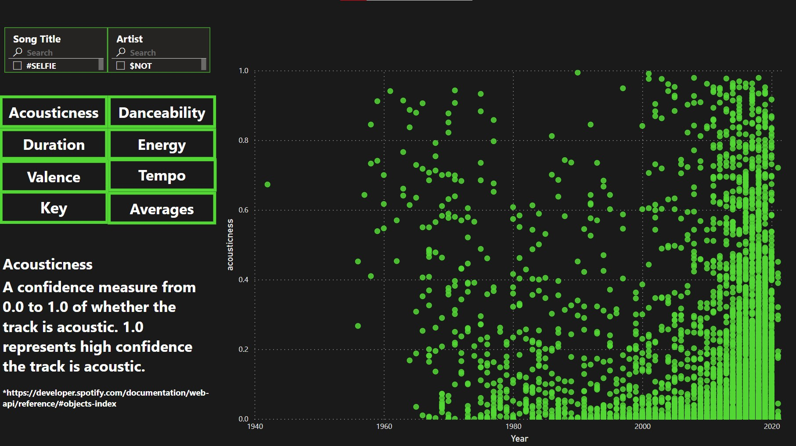
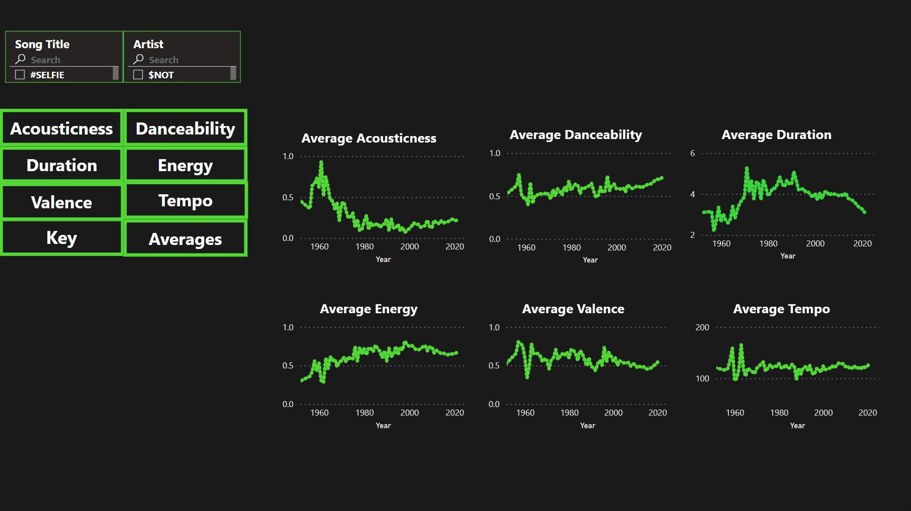
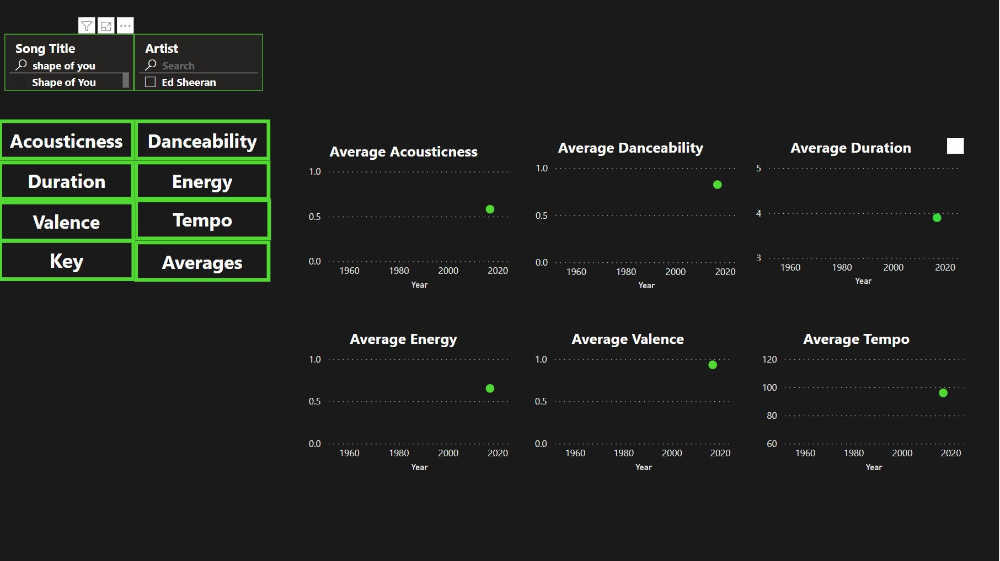
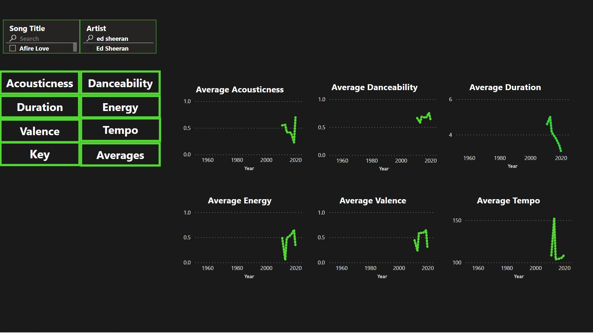
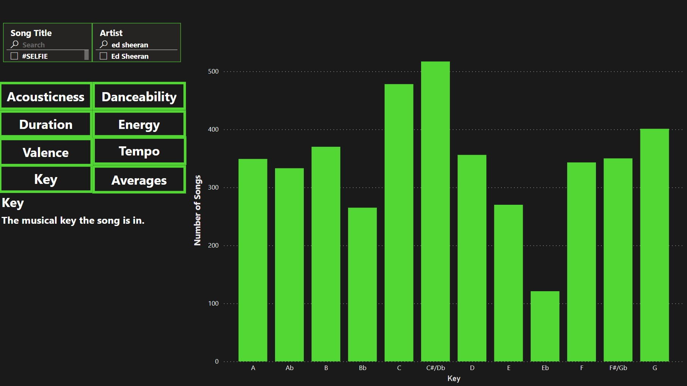

# Popular Music Features
What is the bare minimum I must do to make a hit song in 2021? I want to examine hit songs to see what audio and musical features they have in common. 

## Table of contents
* [General info](#general-info)
* [Dashboard](#dashboard)
* [Technologies](#technologies)
* [Features](#features)
* [Limitations](#limitations)
* [Inspiration](#inspiration)

## General info
As a musician I am very curious about what makes a song popular. I also want to know what kinds of music make the most money. 
Why does one song resonate with millions of people while many other songs go unnoticed? 
This analysis gives me a good starting place to answer this question.

The first question is: How do we identify a "popular" song? To answer this question I went to Spotify. I found a playlist of songs that all had over 100 million streams. 
Spotify pays between $0.003 and $0.005 per stream, so on the low end each song on this list should have made AT LEAST $300,000 from Spotify alone. 
Money made and popularity in hand it was time to actually get the data from this playlist.

Using the Spotify API I pulled Track Info and Audio Features for each of these 4,100+ tracks using Python. After getting the data, cleaning it, and putting it into a manageable DataFrame I exported to a csv file. 
From there I identified any remaining data issues and corrected them (some artist names didn't import correctly, song duration was still in milliseconds, etc). 

After the data was cleaned it was time to build a dashboard in PowerBI.

## Dashboard
Link to PowerBI Public:
https://app.powerbi.com/groups/me/reports/f3178c5b-ea83-47e1-9429-5a8acea96d9d/ReportSection13214d2b83ed1c6a2845

On the left we have the different measures for our music analysis. The scatter plot on the right shows individual songs by year. Each green dot represents a song, and mousing over the dot tells us the song title, artist, and release year. 
In this particular measure we are looking at the "Acousticness" of the song, which is how likely a song uses acoustic instrumentation (such as a guitar or piano) rather than electronic instruments (such as an electric guitar or a drum machine). 
The higher on the plot a song is on the Y-axis, the more likely it is an acoustic song. 
Our most acoustic song: Carol of the Bells 
Least acoustic song: Baby Got Back

If we zoom out and look at all of our measures on average over time, we can see how popular music uses these audio features

Using the search features on the top left we can look at all features at once for a particular song or artist

Also of note (ha!) I also looked at what key each song was in. Below is a breakdown of how many songs were in each musical key. 
Knowing what key a song is in lets the musicians who are performing the actual music of the song to know which notes are the right notes to play. 

## Technologies
* Python using Jupyter Notebooks
* Python packages: pandas, numpy, requests, spotipy, json
* Spotify
* Excel
* PowerBI

## Features
List of features ready 
* Able to see distribution of songs along different audio features
* Can search by song title or artist to see where they land on a distribution

To-do list:
* Adding a way to filter by genre
* Would like to add a lyrical analysis, but that might be a completely different project

Limitations of the Data:
While Spotify does have most music, it does not have all music. Artists such as Garth Brooks are not on Spotify, and Taylor Swift has only been added recently. 

Also, looking at the release year tells us what songs from that year are still popular, not necessarily the trends over time. Spotify has been around since 2008, so these popular songs from decades past are the music that is still popular from that time, not necessarily all popular music from that time. 
In a future project it would be interesting to take top 40 hits going back to the 1940s and see the full picture of the trends over time, but that was outside of the scope of this project since I was focused on what is popular now.

## Inspiration
I've been performing music for over 20 years. Every now and then you get these magical songs that always go over well with an audience. I also wanted to learn more about APIs and working with music data.  

