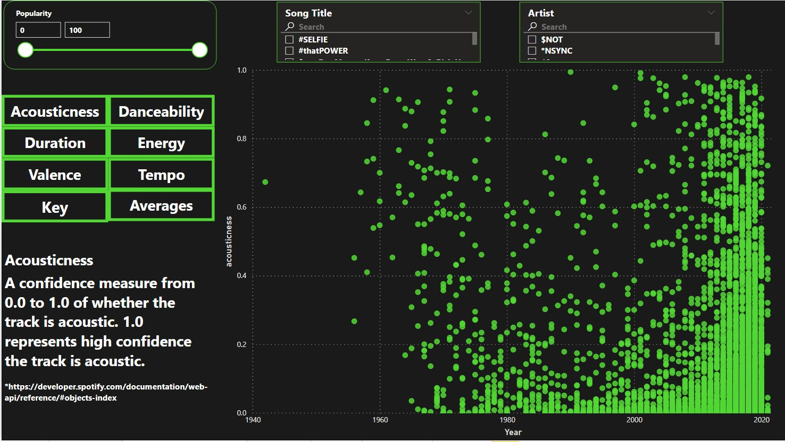
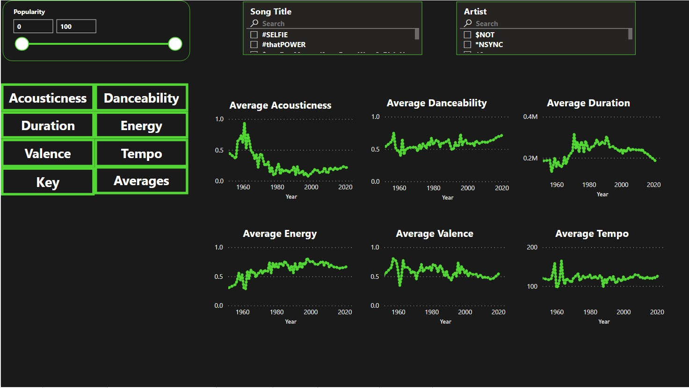
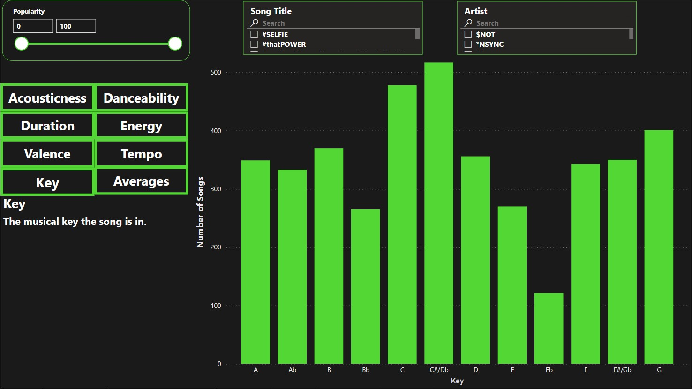

# Popular Music Features
> What is the bare minimum I must do to make a hit song in 2021? I want to examine hit songs to see what audio and musical features they have in common. 

## Table of contents
* [General info](#general-info)
* [Dashboard](#dashboard)
* [Technologies](#technologies)
* [Features](#features)
* [Status](#status)
* [Inspiration](#inspiration)
* [Contact](#contact)

## General info
As a musician I am very curious about what makes a song popular. 
Why does one song resonate with millions of people while many other songs go unnoticed? 
This analysis gives me a good starting place to answer this question.

The first question is: How do we identify a "popular" song? To answer this question I went to Spotify. I found a playlist of songs that all had over 100 million streams. 
Spotify pays between $0.003 and $0.005 per stream, so on the low end each song on this list should have made AT LEAST $300,000 from Spotify alone. 
Money made and popularity in hand it was time to actually get the data from this playlist.

Using the Spotify API I pulled Track Info and Audio Features for each of these tracks using Python. After getting the data, cleaning it, and putting it into a manageable DataFrame I exported to a csv file. 
From there I identified any remaining data issues and corrected them (some artist names didn't import correctly, song duration was still in milliseconds). 

After the data was cleaned it was time to build a dashboard in PowerBI.

## Dashboard
On the left we have the different measures for our music analysis. The scatter plot on the right shows individual songs by year. In this particular measure we are looking at the "Acousticness" of the song, which is how likely a song uses acoustic instrumentation (such as a guitar or piano) rather than electronic instruments (such as an electric guitar or a drum machine). 
The higher on the plot a song is on the Y-axis, the more likely it is an acoustic song. 
Our most acoustic song: Carol of the Bells 
Least acoustic song: Baby Got Back

If we zoom out and look at all of our measures on average over time, we can see how popular music uses these audio features

Also of note (ha!) I also looked at what key each song was in. Below is a breakdown of how many songs were in each musical key. 
Knowing what key a song is in lets the musicians who are performing the actual music of the song to know which notes are the right notes to play. 

## Technologies
* Python using Jupyter Notebooks
* Python packages: pandas, numpy, requests, spotipy, json
* Spotify
* Excel
* PowerBI

## Features
List of features ready 
* Awesome feature 1
* Awesome feature 2
* Awesome feature 3

To-do list:
* Wow improvement to be done 1
* Wow improvement to be done 2

## Status
Project is: _in progress_, _finished_, _no longer continue_ and why?

## Inspiration
Add here credits. Project inspired by..., based on...

## Contact
Created by [@flynerdpl](https://www.flynerd.pl/) - feel free to contact me!